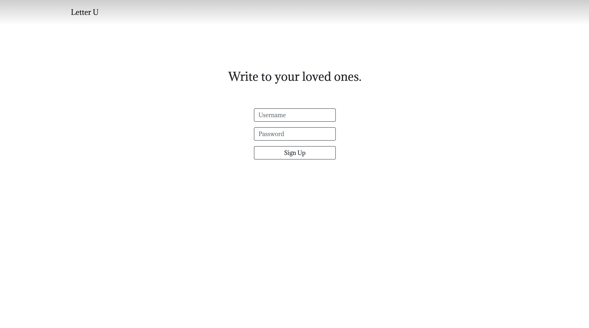

# Letter U

## About

**Letter U** is a Node app that allows users to send and receive letters to and from other users.

On the back end, Letter U uses Passport.js and express-session to authenticate users and manage/maintain sessions. The letters and user information are stored in MongoDB Atlas Database. To keep user information secure, passwords are salted and hashed before they are stored in the database.

On the front end, Letter U uses EJS and Bootstrap to create responsive designs for different viewports.

## Features

**Sign Up Page**

This page allows new users to create new credentials which will be used to log in, write letters, and see sent/received letters.

**Log In Page**

This page allows users to use the credentials they made to log in, write letters, and see sent/received letters.

**Compose Page**

This page allows users to compose letters to other existing users.

**Sent/Received Pages**

This page displays the letters users have sent/received sorted by the date in descending order.

## Demo

Check out Letter U in action: [letter-u.herokuapp.com](https://letter-u.herokuapp.com/)
